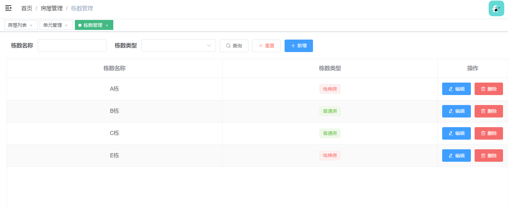
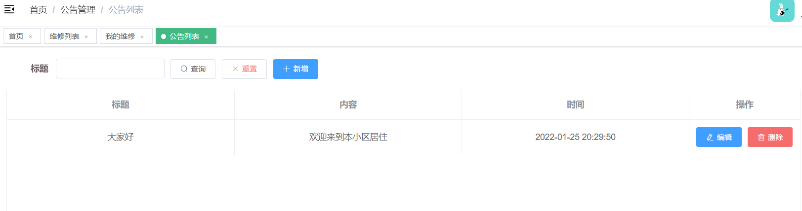

# 小区物业管理系统

#### 简介

这是一个 SpringBoot + Vue 的前后端分离小区物业管理系统，前端使用了若依的后台管理模板，使用 ElementUI 作为 UI 组件，使用 Vue—Router 来进行路由跳转，使用 Vuex 来存储状态信息，使用 Axios 来进行接口数据的接受。后端使用 Mybatis-Plus 来方便进行对数据库的操作， 使用 MySQL数据库进行数据存储，并使用 Druid 数据库连接池来优化数据连接查询，并使用 SpringSecurity 来进行用户的认证和授权，保证系统的安全性。前后端采用 jwt 来进行数据之间的状态信息交互。

#### 功能

**管理员**

- 用户管理
- 角色管理
- 菜单管理
- 房屋管理
- 车位管理
- 业主管理
- 收费管理
- 投诉管理
- 维修管理
- 公告管理
- 缴费记录

**业主**

- 我的缴费记录
- 我的投诉
- 我的维修
- 公告

#### 示例

